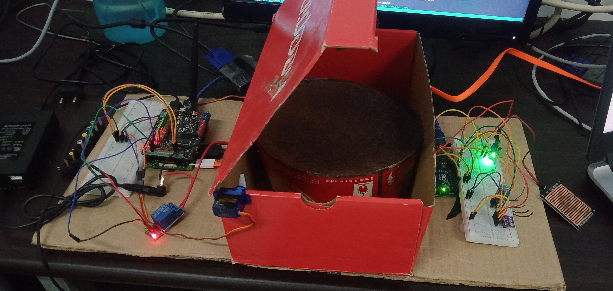

# Purwarupa sistem penjemur kopi otomatis menggunakan Fuzzy Logic Mamdani
Proyek ini adalah sebuah purwarupa (prototype) yang mengimplementasikan sistem penjemur kopi otomatis menggunakan Fuzzy Logic Mamdani. Dirancang untuk mengatasi tantangan cuaca yang tidak menentu, sistem ini secara cerdas mengotomatisasi penutupan kanopi dan pengaktifan pemanas, memastikan proses penjemuran biji kopi berjalan optimal terlepas dari kondisi lingkungan. Tujuan utamanya adalah untuk meminimalkan risiko kerusakan biji kopi akibat hujan dan memaksimalkan efisiensi penjemuran, yang pada akhirnya dapat meningkatkan kualitas hasil panen.

### Read our paper on [Laporan Akhir](images/Laporan-Akhir-Sister.pdf)

## Gambaran Umum Sistem
Sistem ini memiliki arsitektur dual-mikrokontroler di mana Arduino Uno bertanggung jawab dalam membaca data dari sensor dan mengirimkannya ke Raspberry Pi 2. Raspberry Pi 2, sebagai unit pemrosesan utama, mengolah data tersebut dengan Fuzzy Logic Mamdani untuk mengambil keputusan cerdas. Keputusan ini digunakan untuk mengontrol aktuator seperti motor servo (kanopi) dan pemanas bilik. Seluruh data sensor dan status sistem dikirim ke Firebase secara real-time untuk pemantauan melalui aplikasi web atau mobile.

 
 

## Fitur utama

####  Otomatisasi Cerdas Berbasis Logika Fuzzy:
Menggunakan Fuzzy Logic untuk menganalisis berbagai kondisi cuaca secara kompleks dan mengambil keputusan yang adaptif.

#### Arsitektur Dual-Mikrokontroler:
Menggabungkan tugas akuisisi data (Arduino) dan pemrosesan logika (Raspberry Pi).

#### Monitoring Real-time:
Data dapat dipantau dari jarak jauh melalui Firebase dan antarmuka web yang terhubung.

Figure 1. Gambar purwarupa menampilkan prototipe sistem penjemur kopi otomatis secara keseluruhan. Terlihat kanopi pelindung yang dapat digerakkan, serta lokasi penempatan berbagai sensor (seperti sensor hujan dan sensor suhu/kelembaban) dan aktuator (motor servo dan pemanas). Gambaran ini memberikan visualisasi yang jelas tentang bagaimana komponen-komponen hardware berinteraksi satu sama lain dalam sistem fisik yang telah dibangun.

## Cara Kerja Sistem:
1. Akuisisi Data: Arduino Uno secara berkala membaca data dari sensor-sensor lingkungan.
2. Pengiriman Data: Data dari Arduino dikirimkan ke Raspberry Pi melalui komunikasi serial.
3. Pemrosesan Logika: Raspberry Pi 2 memproses data sensor menggunakan algoritma Fuzzy Logic untuk menentukan apakah cuaca cerah (kanopi terbuka) atau hujan (kanopi tertutup dan pemanas menyala).
4. Pengendalian Aktuator: Berdasarkan keputusan Fuzzy Logic, Raspberry Pi menggerakkan aktuator yang sesuai.
5. Penyimpanan & Monitoring: Semua data sensor dan status aktuator diunggah ke Firebase untuk monitoring secara real-time.

## Aplikasi monitoring berbasis web
[Aplikasi monitoring berbasis web](https://penjemur-kopi.vercel.app/)

## Logsheet
1. Syabana Minggus Noviantosa | 118140122 | Teknik informatika
2. Solafide Zamili | 121140201 | Teknik Informatika
3. Marchel Ferry Timoteus  Samosir | 121140195 | Teknik Informatika
4. Hamas Azhar | 119140138 | Teknik Informatika